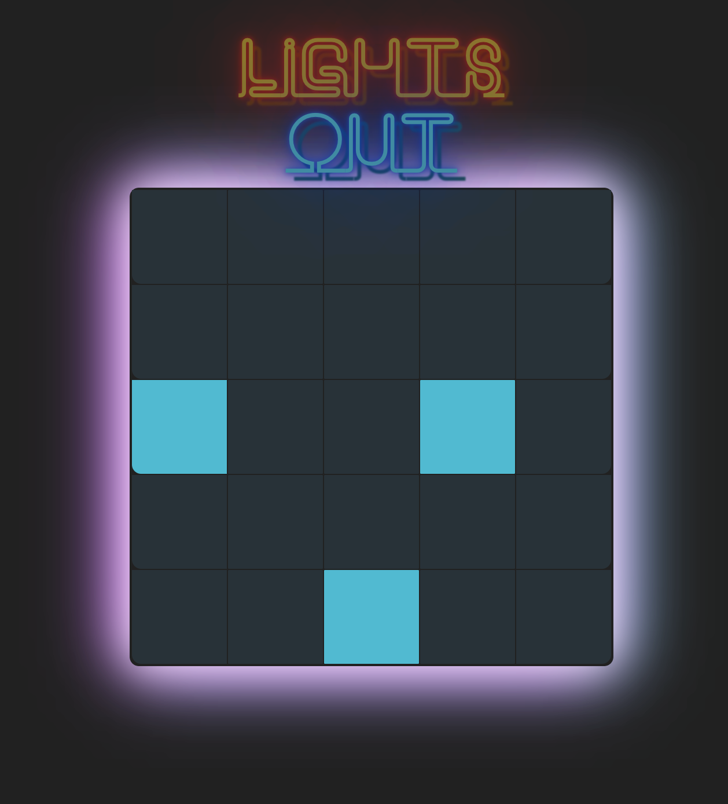

Lights Out
==========

This programming challenge is based on a game from my childhood called *Lights Out*. From [Wikipedia][wiki]:

> The game consists of a 5 by 5 grid of lights. When the game starts, a random number or a stored pattern of these lights is switched on. Pressing any of the lights will toggle it and the adjacent lights. The goal of the puzzle is to switch all the lights off, preferably in as few button presses as possible.

For example:

Screenshots:

Technology Used
==========
- React
- CSS animations

To Play
==========
- Clone repo
- Run npm install
- Run npm start
- Go to localhost:3000 on browser
